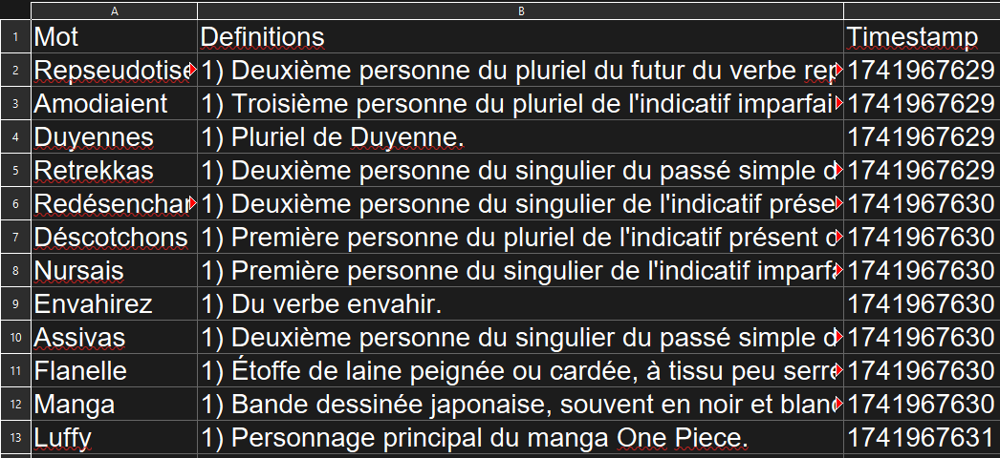

<!-- TOC -->
* [French language tools](#french-language-tools)
  * [Dictionary](#dictionary)
    * [Example](#example)
  * [Lexicon](#lexicon)
    * [Examples](#examples)
      * [Add a new word to the lexicon from the dictionary](#add-a-new-word-to-the-lexicon-from-the-dictionary)
      * [Insert a new word to the lexicon manually](#insert-a-new-word-to-the-lexicon-manually)
      * [Find a word in the lexicon](#find-a-word-in-the-lexicon)
      * [Delete a lexicon entry](#delete-a-lexicon-entry)
  * [Word analyzer](#word-analyzer)
    * [Examples](#examples-1)
      * [Various filters](#various-filters)
      * [Anagram filter](#anagram-filter)
<!-- TOC -->

# French language tools
Series of tools using a French dictionary in `.csv` format.
The file contains +900,000 words with their spelling variations, their plurals, their conjugations etc. as well as their definitions, also in French. It was generated in Python on the basis of an XML file containing the database of fr.wiktionary and according to methods explained in detail in the "Upstream" folder, the XML not being in the final git due to its significant weight.

The .csv dataset was also published on Kaggle : https://www.kaggle.com/datasets/kartmaan/dictionnaire-francais

## Dictionary
Retrieves the definition(s) of a word in the dictionary.

### Example
The function `define()` takes 4 arguments:
- `dataframe`: The Pandas dataframe referring to the .csv dictionary
- `word_column_name`: The name of the column containing the words
- `definition_column_name`: The name of the column containing the definitions
- `word`: The word to search for

```python
define(dataframe=df, word_column_name="Mot", definition_column_name="Définitions", word="Hallali")
>>> ['Cri de victoire dans la chasse à courre, pour annoncer que la bête est aux abois.', "Ton de chasse que l'on sonne pour annoncer que la bête se rend."]
```

## Lexicon
Tools for saving dictionary or custom words to an Excel .xlsx file. The tool allows, among other things, to:
- Add words and its definitions from dictionary to the lexicon
- Insert a personal word and its definitions to the lexicon
- Find if a word is present in the lexicon
- Delete a word from the lexicon



### Examples
#### Add a new word to the lexicon from the dictionary
The `add_word()` function takes 3 arguments:
- `dataframe`: The Pandas dataframe referring to the .csv dictionary
- `workbook`: Workbook object (openpyxl) referring to the spreadsheet.
- `word`: Word present in the dictionary to add in the lexicon.

```python
add_word(dict_df, sheet, "manga")
>>> "The word 'Manga' has been added to the lexicon."
```

#### Insert a new word to the lexicon manually
The `insert()` function takes 3 arguments:
- `workbook`: Workbook object (openpyxl) referring to the spreadsheet.
- `word`: Word to insert.
- `definition`: Word definition. If there are several definitions, they can be placed in a list.

```python
insert(sheet, "Luffy", "Personnage principal du manga One Piece.")
>>> "The word 'Luffy' has been added to the lexicon."
```

#### Find a word in the lexicon
The `search()` function retrieves an entry from the lexicon, using 2 mandatory arguments:
- `workbook`: Workbook object (openpyxl) referring to the spreadsheet.
- `word`: Word to search.

The function returns in order:
- 0: The index 
- 1: The word searched for 
- 2: The definition 
- 3: The timestamp of the addition to the lexicon.
```python
search(sheet, "Luffy")
>>> (14, 'Luffy', '1) Personnage principal du manga One Piece.', '1741967631')
```

#### Delete a lexicon entry
The `delete()` function takes 2 arguments:
- `workbook`: Workbook object (openpyxl) referring to the spreadsheet.
- `word`: Word to delete.

```python
delete(sheet, "Manga")
>>> "The word 'Manga' has been deleted from the lexicon."
```

## Word analyzer
The `multi_filter` function is used to filter dictionary words according to several specific criteria.
The 2 mandatory arguments are :
- `dataframe`: The Pandas dataframe referring to the .csv dictionary
- `col_name`: The name of the column containing the words

The `multi_filter` function has also 8 filters that can be activated by entering the associated arguments :
- `no_comp`: Remove compound words from the analysis (bool).
- `length`: Word length required (int).
- `start_with`: Letters to appear at the beginning of the word (str).
- `end_with`: Letters to appear at the end of a word (str).
- `nth_letters`: Letter to appear in the desired position (list).
- `contains`: Letters that the word must contain (list).
- `not_contain`: Letters the word must not contain (list).
- `anagram`: The words must be anagrams of the letters given as arguments (list).

### Examples
#### Various filters
Here we want :
- The word begins with the letter “g”.
- The word ends with the letters “it”.
- The word contains the letters “a”, and “u”.
- The word does not contain the letter “b”.
- The second letter of the word is an “r” and the fourth is a “t”.
- The length of the word is 7.
```python
multi_filters(df,
              col_name="Mot",
              start_with="g",
              end_with="it",
              contains=["a","u"],
              not_contain=["b"],
              nth_letters=[[2,"r"], [4,"t"]],
              length=7)

>>> Filtering...
            Mot                                        Définitions
368175  Gratuit            ["Qu'on donne, sans y être tenu.", '…']
371798  Grutait  ["Troisième personne du singulier de l'indicat...
```

#### Anagram filter
Here we want to filter out all words that : 
- Are an anagram of the letters "c", "a", "r", "t" and "e". 
- Are of length 5.

```python
multi_filters(df, 
              col_name="Mot",
              anagram=["c","a","r","t","e"],
              length=5)

>>> Filtering...
          Mot                                        Définitions
7609    Acter  ['Noter par écrit une décision sur un acte.', ...
121041  Caret  ["Tortue des côtes de l'Amérique, du Mexique, ...
122559  Carte  ["Représentation, à échelle réduite, de la géo...
122828  Carté                               ['Du verbe carter.']
189149  Crèta  ['Troisième personne du singulier du passé sim...
189291  Créat  ["Manège Le sous-écuyer dans une école d'équit...
190245  Créât                                ['Du verbe créer.']
190353  Crêta  ['Troisième personne du singulier du passé sim...
194190  Cérat  ["Pharmacie Sorte d'onguent composé principale...
614589  Recta                                ['Ponctuellement.']
892823  Terça  ['Troisième personne du singulier du passé sim...
903137  Trace  ["Vestige qu'un homme ou un animal laisse à l'...
903367  Tracé  ['Ensemble des lignes par lesquelles on indiqu...
950585  Écart  ["Action par laquelle deux parties d'une chose...
```